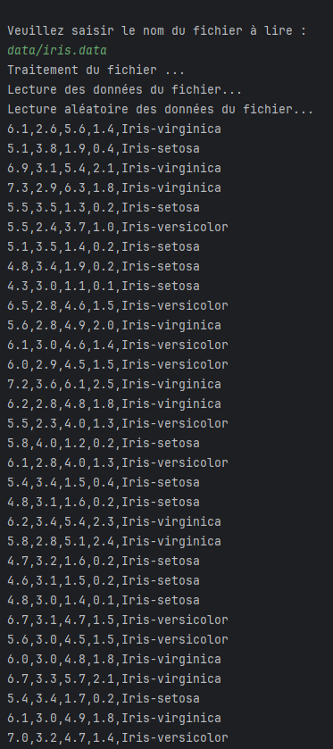

<h1> Self Organizing Map </h1>

## 🌍 Versiones multilingües del README

- 🇫🇷 [Français](./README.fr.md)
- 🇬🇧 [English](.README.md)
- 🇪🇸 [Español (aquí)](#)

## 📘 Descripción del Proyecto

Este proyecto consiste en una implementación simplificada de una **Self-Organizing Map (SOM)** realizada en **Licenciatura 3** en la **Université Paris 8**. También está disponible una versión **C** de este proyecto. Puedes consultar el repositorio de la versión C [aquí](https://github.com/Fab16BSB/SOM_C). El objetivo principal era comprender el funcionamiento del algoritmo SOM reproduciendo una versión *from scratch* con las siguientes restricciones:

- **No se usan variables globales.**  
- Los **BMU (Best Matching Units)** se almacenan en una **lista enlazada**.  
- El tamaño de las colecciones: matrices y listas enlazadas debe ser **calculado dinámicamente**.  

---

### 📊 Conjunto de datos

El conjunto de datos utilizado es el **conjunto de datos Iris**, disponible en Kaggle:  
[Iris Dataset](https://www.kaggle.com/uciml/iris)

- **150 muestras**  
- **4 características** por muestra:  
  - Longitud del sépalo  
  - Ancho del sépalo  
  - Longitud del pétalo  
  - Ancho del pétalo  
- **3 clases**:  
  1. Iris-setosa  
  2. Iris-versicolor  
  3. Iris-virginica  

---

### ⚙️ Funcionamiento del algoritmo SOM

La **Self-Organizing Map (SOM)** es una red neuronal no supervisada utilizada para la reducción de dimensionalidad y la visualización de datos. Estos son los pasos principales:

1. **Inicialización**  
   Las neuronas del mapa se inicializan aleatoriamente en el espacio de características.  

2. **Cálculo de la distancia**  
   Para cada dato de entrada, se calcula la distancia euclidiana entre ese dato y todas las neuronas.  
   La neurona con la distancia mínima se llama **BMU** (Best Matching Unit). Este proceso sigue el principio **Winner-Takes-All** (WTA), donde solo se selecciona la neurona más cercana al dato de entrada, así como sus vecinos.

3. **Actualización del mapa**  
   El BMU y sus vecinos se ajustan para acercarse al dato de entrada, según una tasa de aprendizaje α. Esto ajusta gradualmente el mapa para que represente mejor los datos de entrada.

4. **Iteración**  
   Los pasos 2 a 3 se repiten durante un número fijo de iteraciones.  
   - La tasa de aprendizaje **disminuye** con el tiempo.  
   - El **tamaño del vecindario** se reduce gradualmente, lo que permite que el mapa se especialice mientras mantiene la coherencia topológica.

El resultado es un mapa organizado topológicamente, donde las clases similares se encuentran en áreas cercanas. El algoritmo SOM agrupa así los datos similares mientras preserva su estructura.

---

### 🧑‍💻 Tecnologías utilizadas

- **Lenguaje:** Java (implementación desde cero)
  
---

### 💻 Instalar Java (Si no tienes Java instalado)

Si no tienes Java instalado, puedes seguir las instrucciones en uno de mis videos de YouTube para instalar Java en diferentes plataformas:

- **Linux**: [Instalar Java en Linux](https://www.youtube.com/watch?v=-9G2YARJ0jM)
- **Mac**: [Instalar Java en Mac](https://www.youtube.com/watch?v=hts1lGSKZfc&t=1s)
- **Windows**: [Instalar Java en Windows](https://www.youtube.com/watch?v=vCQHCYM_OVY)
  
---

### 📝 Compilación y ejecución
Puedes compilar y ejecutar el proyecto **localmente** o usando **Docker**.

#### ⚡ Opción 1: Compilación y Ejecución Local

1. **Clonar el repositorio**

   ```bash
   git clone https://github.com/Fab16BSB/SOM_JAVA.git
   cd SOM_JAVA/code
   ```
2. **Compilación**

   ```bash
   javac *.java
   ```

3. **Ejecución**

   ```bash
   cd ..
   java code.Lancement
   ```

  #### 🐳 Opción 2: Uso de Docker
  
  1. **Clonar el repositorio**
  
      ```bash
      git clone https://github.com/Fab16BSB/SOM_C.git
      cd SOM_C
      ```
  
  2. **Construir la imagen de Docker**
  
      ```bash
      docker build -t som_c .
      ```
  
  3. **Ejecutar el contenedor de Docker**
     
      ```bash
      docker run --rm -it som_c
      ```

---

### 📈 Resultados



---

### 🙌 Agradecimientos
Quiero agradecer a mi profesor por ofrecerme este proyecto y por sus valiosos consejos.


