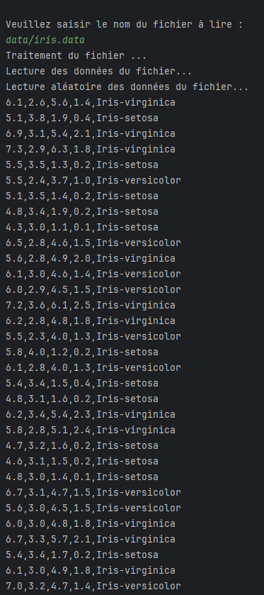

<h1> Self Organizing Map </h1>

## 🌍 Versions multilingues du README

- 🇫🇷 [Français (vous êtes ici)](#)
- 🇬🇧 [English](./README.md)
- 🇪🇸 [Español](./README.es.md)

## 📘 Vue d'ensemble du projet

Ce projet consiste en une implémentation simplifiée d'une **Self-Organizing Map (SOM)** réalisée en **Licence 3** à l'**Université Paris 8**. Une version **C** de ce projet est également disponible. Vous pouvez consulter le dépôt de la version C [ici](https://github.com/Fab16BSB/SOM_C). L’objectif principal était de comprendre le fonctionnement de l’algorithme SOM en reproduisant une version *from scratch* avec les contraintes suivantes :

- **Aucune variable globale** utilisée.  
- Les **BMU (Best Matching Units)** sont stockés dans une **liste chaînée**.  
- La taille des collections: matrices et listes chaînées doivent être **calculée dynamiquement**.  

---

### 📊 Jeu de données

Le jeu de données utilisé est le **jeu de données Iris**, disponible sur Kaggle :  
[Iris Dataset](https://www.kaggle.com/uciml/iris)

- **150 échantillons**  
- **4 caractéristiques** par échantillon :  
  - Sepal length  
  - Sepal width  
  - Petal length  
  - Petal width  
- **3 classes** :  
  1. Iris-setosa  
  2. Iris-versicolor  
  3. Iris-virginica  

---

### ⚙️ Fonctionnement de l’algorithme SOM

La **Self-Organizing Map (SOM)** est un réseau de neurones non supervisé utilisé pour la réduction de dimensionnalité et la visualisation de données. Voici les grandes étapes :

1. **Initialisation**  
   Les neurones de la carte sont initialisés aléatoirement dans l’espace des caractéristiques.  

2. **Calcul de la distance**  
   Pour chaque donnée d’entrée, on calcule la distance euclidienne entre cette donnée et tous les neurones.  
   Le neurone avec la distance minimale est appelé **BMU** (Best Matching Unit). Ce processus suit le principe du **Winner-Takes-All** (WTA), où seul le neurone le plus proche de la donnée d'entrée est sélectionné, ainsi que ses voisins.

3. **Mise à jour de la carte**  
   Le BMU et ses voisins sont ajustés pour se rapprocher de la donnée d’entrée, selon un taux d’apprentissage α. Cela permet d'ajuster progressivement la carte pour qu'elle représente mieux les données d'entrée.

4. **Itération**  
   Les étapes 2 à 3 sont répétées pendant un nombre d’itérations fixé.  
   - Le taux d’apprentissage **diminue** au fil du temps.  
   - La **taille du voisinage** se rétracte progressivement, ce qui permet à la carte de se spécialiser tout en maintenant la cohérence topologique.

Le résultat est une carte organisée topologiquement, où les classes similaires se retrouvent dans des zones proches. L'algorithme SOM permet ainsi de regrouper les données similaires tout en préservant leur structure.

---

### 🧑‍💻 Technologies utilisées

- **Langage :** Java (implémentation from scratch)  
---

### 💻 Installer Java (Si vous n'avez pas Java installé)

Si vous n'avez pas Java installé, vous pouvez suivre les instructions dans l'une de mes vidéos YouTube pour installer Java sur différentes plateformes :

- **Linux**: [Installer Java sur Linux](https://www.youtube.com/watch?v=-9G2YARJ0jM)
- **Mac**: [Installer Java sur Mac](https://www.youtube.com/watch?v=hts1lGSKZfc&t=1s)
- **Windows**: [Installer Java sur Windows](https://www.youtube.com/watch?v=vCQHCYM_OVY)

---

### 📝 Compilation et exécution
Vous pouvez compiler et exécuter le projet soit **localement**, soit en utilisant **Docker**.

#### ⚡ Option 1 : Compilation et Exécution Locale

1. **Cloner le dépôt**

   ```bash
   git clone https://github.com/Fab16BSB/SOM_JAVA.git
   cd SOM_JAVA/code
   ```

2. **Compilation**

   ```bash
   javac *.java
   ```

3. **Exécution**

   ```bash
   cd ..
   java code.Lancement
   ```

#### 🐳 Option 2 : Utilisation de Docker

1. **Cloner le dépôt**
   
```bash
git clone https://github.com/Fab16BSB/SOM_C.git
cd SOM_C
```

2. **Construire l'image Docker**
   
```bash
docker build -t som_c .
```

3. **Exécuter le conteneur Docker**
```bash
docker run --rm -it som_c
```

---

### 📈 Résultats



---

### 🙌 Remerciements
Je souhaite remercier mon enseignant pour m'avoir proposé ce projet ainsi que pour ses précieux conseils.

